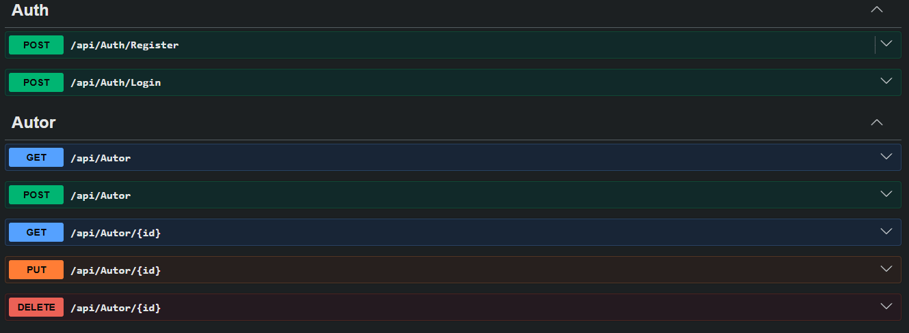
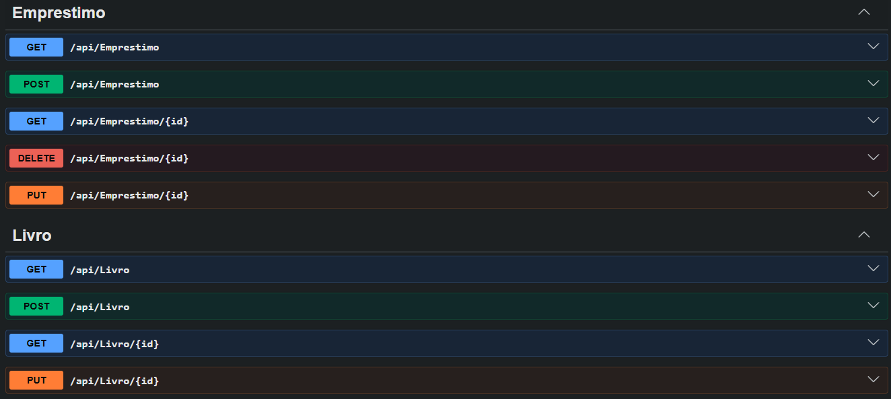
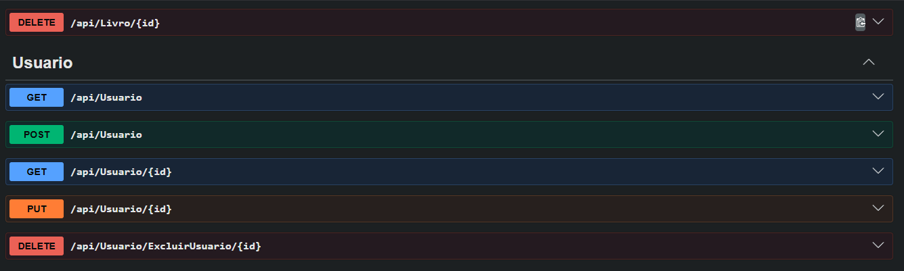
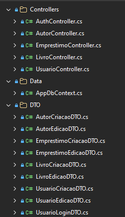
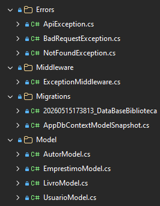

# Projeto pessoal: API RESTful de Biblioteca

# Desenvolvimento de API utilizando ASP.NET Core, Entity Framework Core e SQL Server, com autenticação JWT, Swagger, 
  middleware global de exceções e arquitetura em camadas.

# Funcionalidades
- Cadastro de usuários
- Login com JWT
- Cadastro de autores
- Cadastro de livros
- Controle de empréstimos
- Tratamento global de exceções

# Prints do Swagger

# Prints da Estrutura

